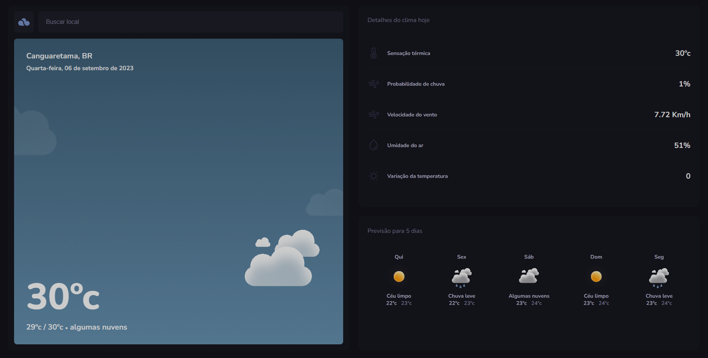
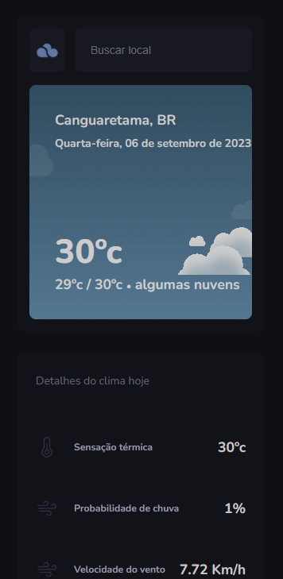

# TypeWeather

> Projeto desenvolvido pela empresa [Rocketseat](https://app.rocketseat.com.br) programa Explorer.

O TypeWeather é um aplicativo de previsão do tempo que permite aos usuários pesquisar o clima de diferentes locais e obter detalhes sobre a temperatura, sensação térmica, probabilidade de chuva, velocidade do vento, umidade do ar e variação da temperatura. Além disso, o aplicativo fornece previsões para até 5 dias.

## Interface do Usuário

A interface inicial do TypeWeather possui uma barra de pesquisa na qual os usuários podem inserir o nome do local que desejam verificar. Ao clicar no resultado da pesquisa, eles são direcionados para uma página de detalhes que exibe informações detalhadas sobre o clima, incluindo:

- **Temperatura:** 30°C
- **Sensação Térmica:** 30°C
- **Probabilidade de Chuva:** 1%
- **Velocidade do Vento:** 7.72 Km/h
- **Umidade do Ar:** 51%
- **Variação da Temperatura:** 0.

## Tecnologias Utilizadas

O projeto TypeWeather foi desenvolvido com as seguintes tecnologias:

- React
- React Router Dom
- Axios
- Day.js
- Vite (Bundler)
- TypeScript
- ESLint (Ferramenta de Linting)

## Contatos

Se tiver alguma dúvida, sugestão ou feedback, sinta-se à vontade para entrar em contato:

- [LinkedIn](https://www.linkedin.com/in/romeu-soares-87749a231/)
- Email: romeuindexjs@gmail.com
- WhatsApp: 84 981127596
